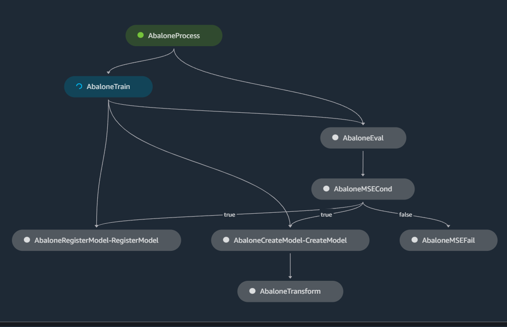

# Salvia - Factory - Abalone

## Problem Description

**Dataset Reference:** [Abalone Dataset](https://www.csie.ntu.edu.tw/~cjlin/libsvmtools/datasets/regression.html)

**Type of problem:** Linear Regression

**Type of solution:** XGBoost using SageMaker Training Job

AWS tutorials related to this example:

- [SageMaker SDK - Define a Pipeline](https://docs.aws.amazon.com/sagemaker/latest/dg/define-pipeline.html)
- [Orchestrate Jobs to Train and Evaluate Models with Amazon SageMaker Pipelines](https://sagemaker-examples.readthedocs.io/en/latest/sagemaker-pipelines/tabular/abalone_build_train_deploy/sagemaker-pipelines-preprocess-train-evaluate-batch-transform.html)
- [SageMaker Examples on GitHub](https://github.com/aws/amazon-sagemaker-examples/tree/main/sagemaker-pipelines/tabular/abalone_build_train_deploy)

This notebook and examples have been adapted to run as a Python project,
with state of the art code check and testing.

TODO pipeline.png

**Steps:**
- download data
- do some data preparation
- split the datasets and upload the datasets to S3
- configure and run the training job
- check the model evaluation

## Main libraries

This project leverages on the following resources:

### libraries required at run time

- pandas, numpy
- xgboost
- scikit-learn
- SageMaker Pipeline
- [Jinja2](https://tedboy.github.io/jinja2/templ10.html)

### Docker images

- Studio's prebuilt image DataScience 3.0 (conda) and XGBoost Stack

### Devops and code quality tools that must installed on the workspace

- nox
- black
- isort
- venv

### Code quality tools used in the build process and installed by nox

- venv
- flake8
- pytest
- mypy
- pytype
- sphinx
- [pymarkdownmnt](https://pypi.org/project/pymarkdownlnt/)

TODO links and description from the module

Thanks to the maintainers and contributors of these modules.

## Examples of project outputs  

[JSON execution report](docs/report-examples/pipeline_execution_report.json)
[Markdown report](docs/report-examples/pipeline_execution_report.md)

## Changelog

### 0.2.0

- configuration of code quality tools
- sample MLOps project based on Abalone
- refactoring of the Abalone tutorial to allow for running tests and lint
- summary reporting of the pipeline execution
